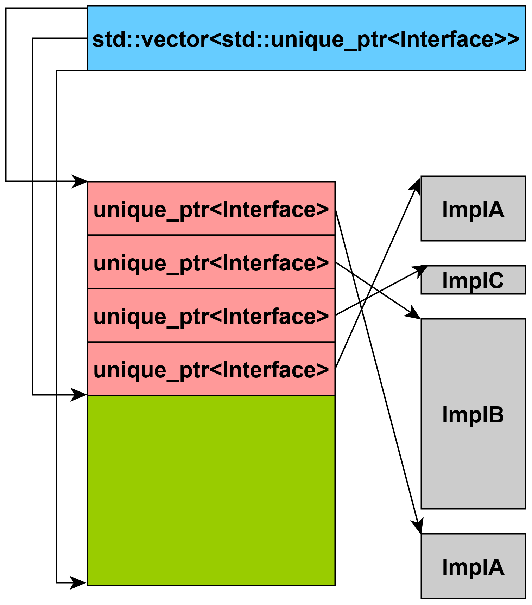

[](https://travis-ci.org/fecjanky/poly_vector)  [](https://coveralls.io/github/fecjanky/poly_vector?branch=master)
# poly_vector

poly_vector is an ```std::vector``` like class template tailored for storing polymorphic objects derived 
from a well-known interface of which the class is parametrized in.
Almost all well-known methods of ```std::vector``` - that were meaningful in this context - are implemented in ```poly_vector``` resulting in
a well-known API for the container operations.

## Usage 

The class template is header only, so it could be used multiple ways:
 * download the raw file, add to your project and/or include it directly
 * build and install the cmake package then use the library in your CMakeLists.txt file:
 
```cmake
find_package(PolyVector CONFIG REQUIRED)

add_executable(MyExecutable  ${MyExecutable_SRC})

target_link_libraries(MyExecutable PolyVector)

 ```


## Example

Given a class hierarchy as illustrated by the figure below:

![Sample Hierarchy][hierarchy]

[hierarchy]: doc/images/demo_hierarchy.png "Class hierarchy example"

One can store implementations of Interface interface in a ```poly_vector<Interface>``` container

```cpp
...
using namespace poly;

poly_vector<Interface> v;

v.push_back(ImplA());
v.emplace_back<ImplB>();
v.emplace_back<ImplC>();

for(const Interface& i : v){
// Invoke doSomething on all objects
    i.doSomething();
}

// remove the last element
v.pop_back();

// invoke doSomething() on ImplB object
v.back().doSomething();

// remove the first elem
v.erase(v.begin());

// invoke doSomething() on ImplB object (again)
v.front().doSomething();

...

```

The default template arguments of ```poly_vector``` allows
that if your implementation classes are regular in terms of copying/moving, ```poly_vector``` will 
capture and maintain that information at the time of insertion on how to clone/move the object around (this behavior is implemented through ```delegate_cloning_policy```).
Also by default it uses the STL default allocator ```std::allocator``` :

```cpp
template <class IF,
    class Allocator = std::allocator<IF>,
    class CloningPolicy = delegate_cloning_policy<IF, Allocator>
>
class poly_vector;
```


## Benefits

```poly_vector``` manages the underlying storage as a single chunk of memory.
It has the following benefits:
* reduced allocation count compared to ```std::vector<std::unique_ptr<Interface>>>``` based alternative
* increased sequential access performance due to locality of references enforced by the structure automatically without the need of custom allocators
* less typing when pushing objects into the the container


The storage layout differences are illustrated by the figures below:



*```std::vector<std::unique_ptr<Interface>>``` memory layout*


*```poly::poly_vector<Interface>``` memory layout*


## Debug Visualiztion support

So far the container has only Visual Studio debugger visualization support. 
If you are using the cmake package and building with Visual Studio the natvis file will be added 
to your project automatically. Otherwise you'll have to install the natvis file manually 
from visualizer/poly_vector.natvis


*Natvis debug visualization*

## TODOs
* documentation of ```cloning_policy``` concept
* document ```delegate_cloning_policy```, ```virtual_cloning_policy``` and ```no_cloning_policy``` cloning policies
* dev docs on internal implementation
* advanced examples with custom cloning policy and/or allocator
* GDB pretty printer
* minor code cleanup

